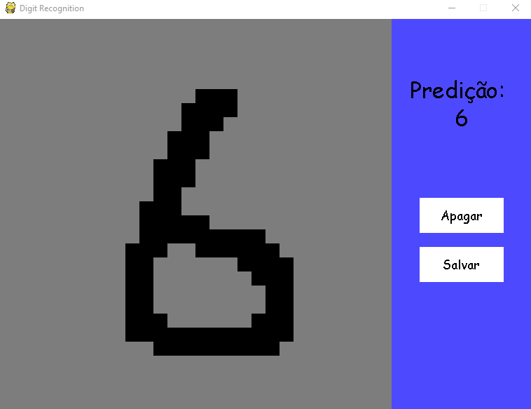

## digitRecognition
Este projeto desenvolvido em python consiste em uma interface que permite ao usuário escrever um digito e em um modelo de machine learning que classifica o digito escrito (0-9).

# A interface
A interface foi desenvolvida utilizado o modulo pygame e consiste em um quadro para desenhar um digito, e dois botoes: Apagar e Enviar. Ao clicar em enviar, o modelo de machine learning tenta prever o digito desenhado baseado no quadro atual.
Se o argumento 'createData' do DigitClassifier estiver setado para True, a interface funciona para gerar novos dados de treino que serão salvos em testdata.npy.

# Reconhecimento do digito
Para o reconhecimento do digito foi utilizada a classe Model, que gerencia o carregamento dos dados de treino e teste, faz o treinamento do modelo e faz a predição. 
Dois algoritmos de classificação são suportados: Suport Vector Machine(SVM) e Random Forest Classifier(RFC).
# Dados de treino
Primeiramente foi usado o dataset mnist para o treinamento do modelo, porém o não mostrava bons resultados para predição dos dados gerados por este sistema.
Por fim, foram gerados dados neste mesmo sistema (digitados manualmente) para o treinamento. Os resultados foram bem superiores, portanto estes foram adotados como default. O dataset utlizado possui cerca de 500 elementos.
# Testes
Segue abaixo alguns testes feitos com os diferentes algoritmos e diferentes dados de treino. Os testes foram realizados com os dados gerados por este próprio sistema (testdata) e pontuação foi obtida com a função "score" contida nos classifiers.
Obs: No caso do treino e teste com o mesmo dataset, os dados foram devidamente separados para treino e teste.
Classifier: RFC - Dados de treino: mnist - Precisão: 0.4902
Classifier: SVM - Dados de treino: mnist - Precisão: 0.5098
Classifier: RFC - Dados de treino: testdata - Precisão: 0.8235
Classifier: SVM - Dados de treino testdata - Precisão: 0.7843
# Modulos utilizados
Estes foram os principais modulos utilizados no projeto:
Pygame: para o desenvolvimento da interface.
Numpy: para o tratamento dos dados.
Scikit-learn: Para os algoritmos de Machine Learning utilizados.
Matplotlib: Para visualização durante os testes.
